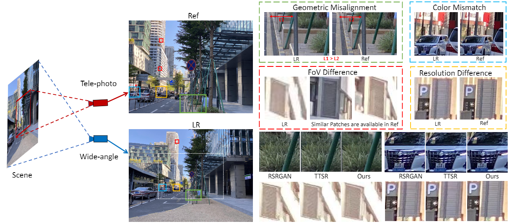

# Dual Camera Super-resolution
Implementation for our ICCV 2021 paper: Reference-based Super-resolution with Aligned Attention Modules

[paper]( ) | [project website](https://tengfei-wang.github.io/Dual-Camera-SR/index.html) | [dataset]( ) | [demo video]( )

 

## Introduction

## Setup
### Installation
```
git clone https://github.com/Tengfei-Wang/DualCameraSR.git
cd DualCameraSR
```

### Environment
This code is based on tensorflow 2.x  (tested on tensorflow 2.0, 2.2, 2.4).

The environment can be simply set up by Anaconda:
```
conda create -n IIVI python=3.7
conda activate IIVI
conda install tensorflow-gpu tensorboard
pip install pyaml 
pip install opencv-python
pip install tensorflow-addons
```

Or, you can also   set up the environment from the provided `environment.yml`:
```
conda env create -f environment.yml
conda activate IIVI
```

## Quick Start
```
python test.py
```


## Training
```
python test.py
```

## Citation
If you find this work useful for your research, please cite:
``` 
@InProceedings{wang2021DCSR,
author = {Wang, Tengfei and Xie, Jiaxin and Sun, Wenxiu and Yan, Qiong and Chen, Qifeng},
title = {Dual-Camera Super-Resolution with Aligned Attention Modules},
booktitle = {International Conference on Computer Vision (ICCV)},
year = {2021}
}
```
